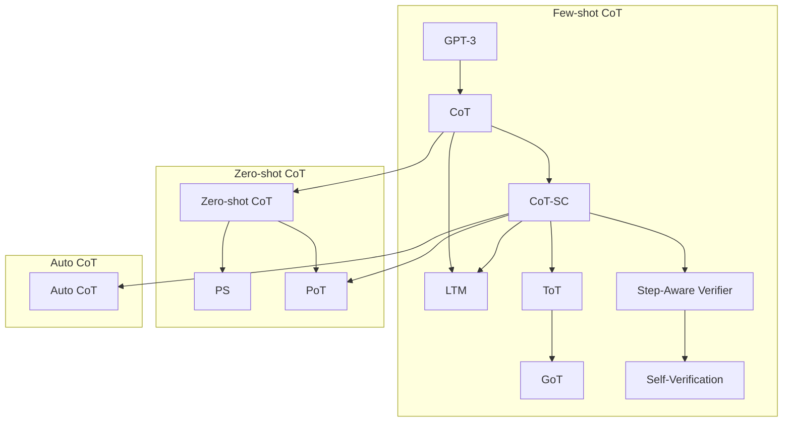

# 基于思维链的相关研究推进路径

| 节点 | 核心 | 链接 | 简介 |
| - | - | - | - |
| GPT-3 |  | <https://arxiv.org/abs/2005.14165> |  |
| CoT | 思维链 | <https://arxiv.org/abs/2201.11903> | 利用针对具体任务的少样本提示使 LLM 逐步思考完成任务，采用贪婪解码方案，只输出最有可能的一条思维链 |
| Zero-shot CoT | 零样本思维链 | <https://arxiv.org/abs/2205.11916> | 利用通用触发句使 LLM 触发思维链模式 |
| CoT-SC | 自洽思维链 | <https://arxiv.org/abs/2203.11171> | 对少样本提示多次采样获得不同的思维链，再通过多数投票聚合获得最终答案 |
| LTM | 由易到难思维链 | <https://arxiv.org/abs/2205.10625> | 修改少样本提示为由易到难规划后的多个子问题的问答对与最后聚合，使 LLM 学会先拆分复杂问题再逐步求解 |
| PoT | 程序化思维 | <https://arxiv.org/abs/2211.12588> | 对复杂数值推理计算任务，要求 LLM 输出可执行代码，在外部执行后再将结果返回 LLM 进行下一步推理，而非直接推理结果 |
| PS | 规划-求解提示 | <https://arxiv.org/abs/2305.04091> | 在 Zero-shot CoT 的基础上在触发句中指示 LLM 进行任务规划再逐步解决 |
| Step-Aware Verifier | 逐步验证思维链 | <https://arxiv.org/abs/2206.02336> | 在 CoT-SC 的基础上，从示例库中随机抽取的多个不同的少样本提示分别进行多次采样以最大化思维路径差异性，并增加专门训练的验证器模型评估推理路径每个步骤的正确性，再采用加权投票机制，根据验证器对每条推理链给出的正确概率对投票进行加权以得到最终答案 |
| Self-Verification | 自我验证思维链 | <https://arxiv.org/abs/2212.09561> | 不引入额外模型，由 LLM 自身执行自我验证。令模型利用生成的答案反向推导问题的已知条件，从而检验答案正确性。为每个候选答案提供一个整体可信度评分来判断答案是否满足问题要求，但无法直接指出哪一步出了错。如果答案不通过自检，只能推断整条推理存在漏洞，需要模型重新尝试其他思路。 |
| ToT | 思维树 | <https://arxiv.org/abs/2305.10601> | 在 CoT-SC 的基础上，允许在每个中间步骤展开多个可能的后续想法，形成分支树并行探索以及回溯，系统地查找最优解路径 |
| GoT | 思维图 | <https://arxiv.org/abs/2308.09687> | 在 ToT 的基础上将思维过程建模为图，允许节点聚合以及反馈回路以实现非线性思维连接 |
| Auto CoT | 自动思维链 | <https://arxiv.org/abs/2210.03493> | 在 CoT-SC 的基础上，先通过 Zero-shot CoT 生成一批样例，再从中筛选质量较高的用于构建 Few-shot 提示  |
| Self-Asking |  | <https://aclanthology.org/2024.findings-emnlp.879/> |  |
| Self-Refine |  | <https://arxiv.org/abs/2303.17651> |  |
| Reflexion |  | <https://arxiv.org/abs/2303.11366> |  |
| ReAct |  | <https://arxiv.org/abs/2210.03629> |  |
| Meta Prompt |  | <https://arxiv.org/abs/2311.11482> |  |
| PAL |  | <https://arxiv.org/abs/2211.10435> |  |
| GraphPrompt |  | <https://arxiv.org/abs/2302.08043> |  |
| Multimodal CoT |  | <https://arxiv.org/abs/2302.00923> |  |
| Directional Stimulus Prompt |  | <https://arxiv.org/abs/2302.11520> |  |
| Active Prompt |  | <https://arxiv.org/abs/2302.12246> |  |
| APE |  | <https://arxiv.org/abs/2211.01910> |  |
| APO |  | <https://arxiv.org/abs/2305.03495> |  |
| Generated Knowledge Prompt |  | <https://arxiv.org/abs/2110.08387> |  |
| Adaptive GoT |  | <https://arxiv.org/abs/2502.05078v1> |  |
