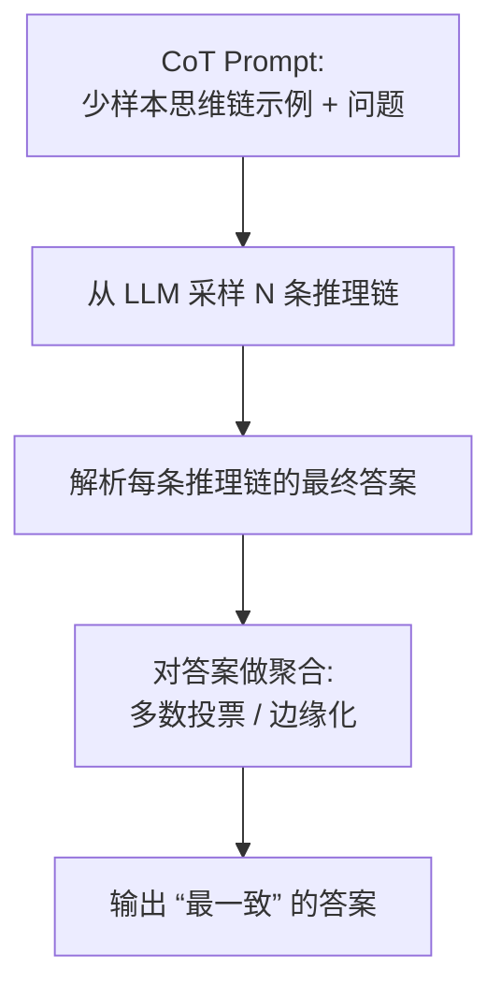

# Self-Consistency Improves Chain of Thought Reasoning in Language Models

## 1. 概览 Overview

### 1.1 个人预览 Personal Preview

> 文章主要关注在已经使用思维链（CoT）提示的前提下，是否还能在不改变模型、不引入额外训练数据的情况下，进一步提升复杂推理任务的准确率。作者指出，常见的 greedy decoding 只生成一条推理路径，容易受到偶然错误的影响，会带来局部最优、路径偏差等问题，导致推理链质量不稳定。为此，论文提出 Self-Consistency 方法：对同一问题采样多条不同的推理链，并对最终答案进行聚合，从而选出最一致的答案。实验表明，该方法在算术、常识和符号推理任务上都能显著提升性能。

### 1.2 内容简介 Description

- **研究背景 Research Background：**  
  Chain-of-Thought prompting 已被证明可以显著提升 LLM 在多步推理任务上的表现，但默认使用的 greedy decoding 往往导致推理路径不稳定。论文认为：复杂推理问题通常存在多种正确的思考路径，如果能从模型中采样到多条路径并进行聚合，就可能比只取一条路径更稳健。

- **研究目标 Research Objectives：**  
  探索一种无需额外监督、无需验证器的推理阶段方法，以进一步提升 CoT 的推理准确率，同时验证该方法在不同模型规模与不同任务（算术、常识、符号）上的普适性与鲁棒性。

- **主要贡献 Main Contributions：**  
  1. 提出 Self-Consistency 解码策略，用采样与聚合替代 CoT 的 greedy decoding。  
  2. 在多个推理基准（如 GSM8K、SVAMP、AQuA、StrategyQA、ARC-challenge）上显著提升 CoT 的准确率。  
  3. 分析不同聚合策略和模型规模下的效果差异。多数投票（unweighted sum）与长度归一化加权求和效果相近，且 Self-Consistency 在更大模型上收益更明显。

---

## 2. 关键信息 Key Information

### 2.1 核心思想与方法 Main Ideas & Methods

- **核心思想：**
复杂推理问题往往存在多条正确推理路径，而错误路径更加分散。因此，通过采样多条推理链并对最终答案进行多数投票，可以提高选中正确答案的概率。

- **实现方法：**



&emsp;&emsp;(1) 采样阶段：按照 CoT 编写少样本示例提示词以激活 LLM 的思维链推理，然后可以用 temperature sampling、top-k、nucleus sampling 等方法从同一个 prompt 生成多条推理链。
&emsp;&emsp;(2) 聚合阶段：把每条推理链的最终答案解析出来，然后多数投票（unweighted sum / majority vote）选出最一致答案。论文也讨论了加权聚合（按生成概率加权、再做长度归一化），但发现多数投票与 “归一化加权求和” 表现非常接近。这是因为对答案集中的每个推理链-答案对而言，其归一化的条件概率```P(CoT_i, answer_i | prompt, question)```非常接近，即 LLM 认为这些生成结果“可能性相似”。此外，条件概率不归一化或是对每个答案加权平均都会导致性能的下降。
聚合策略性能排序如下：
无权求和 ≈ 归一化加权求和 > 无归一化加权求和 > 无归一化加权平均 > 归一化加权平均
需要注意的是，自洽 CoT 不是训练多个模型的 ensemble，而是单模型的 self-ensemble（通过多次采样实现）。

### 2.2 实验设置与结果 Experimental Settings & Results

- **实验设置 Experimental Settings：**  
实验涵盖算术推理（GSM8K、SVAMP）、常识推理（StrategyQA）、符号推理等任务，并在 UL2 20B、GPT-3 175B、LaMDA 137B、PaLM 540B 等不同规模的大模型上进行验证。基线为标准 CoT 以及不同的聚合策略。

- **实验结果 Experimental Results：**  
Self-Consistency 在 GSM8K 上可带来约 +15% 以上的绝对提升，在多项任务上稳定优于 greedy decoding。


---

## 3. 分析思考 Analysis & Thoughts

### 3.1 文章结论 Conclusions

论文表明，在 CoT 提示下，通过简单的采样与聚合策略即可显著提升推理准确率，说明推理阶段策略与模型能力同样重要。

- 推理任务常存在多条正确推理路径，聚合能提升对正确答案的置信度。
- 多数投票非常简单但效果接近更复杂的加权聚合。
- 越大的模型越能从该策略中获益，说明更强模型更容易采样到多条 “不同但正确” 的推理路径。

### 3.2 个人思考 Personal Thoughts

CoT-SC 是一种几乎 “零门槛” 的性能增益方式：不改模型、不改训练，只在推理端增加采样次数和投票逻辑，就能显著提升复杂推理准确率，因此非常适合作为 CoT 的默认解码策略之一。其优势在于实现简单、通用性强，但其计算成本随采样次数线性增长，因此采用自适应采样策略可能会更好一些。
论文提到对不同任务需要不同 parser（例如算术提取第一个数值、常识提取字符串答案等），这意味着 CoT-SC 落地时要关注输出格式稳定性。
CoT-SC 更适合 “最终答案属于固定集合 / 可明确比较一致性” 的任务；对开放式生成（open-ended generation）需要重新定义一致性度量。

---

## 4. 关联文章 Related Works

- Chain of Thought Prompting
- Zero-Shot CoT
- Tree of Thoughts Prompting
