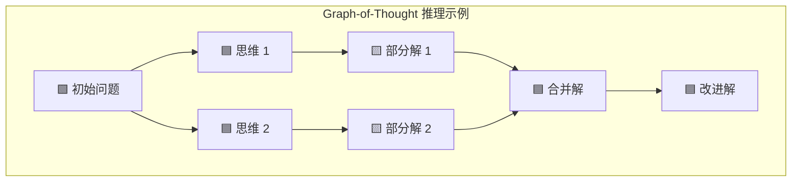

# Graph of Thoughts: Solving Elaborate Problems with Large Language Models

## 1. 概览 Overview

### 1.1 个人预览 Personal Preview

> LLM 在复杂任务求解中表现受到提示策略的影响。现有方法如思维链（CoT）或思维树（ToT）虽然提升了推理能力，但仍然限制了模型的思考结构，只能线性或树状展开。本文提出了一种全新的提示框架思维图（GoT），允许 LLM 在推理过程中构建任意拓扑的 “思维图”，即将中间思维步骤视作节点并通过依赖关系连接。借助该框架，模型可以并行探索多个推理路径、合并不同路径的中间结果，并通过循环反馈优化答案，从而实现更加灵活和强大的问题求解。实验表明，在排序、集合运算、文本摘要等任务上，GoT 显著超越了现有提示策略，在提高解决方案质量的同时降低推理成本。例如，在排序任务中 GoT 将准确率较 ToT 提升了约 62%，并将推理开销降低超过 31%。这一进展不仅表明更通用的思维结构能带来性能提升，也为将 LLM 的推理方式朝着更接近人类思维网络的方向推进提供了新思路。

### 1.2 内容简介 Description

- **研究背景 Research Background：**  
LLM 的推理能力可以通过精心设计提示得到显著提升。CoT 提示通过在输入中加入问题求解的中间步骤，引导模型逐步推理，从而提高了复杂任务的解答能力。此后，进一步的发展如 CoT-SC 策略通过对同一问题采样生成多个思维链并选择最一致的答案，增强了结果的可靠性。后面又出现的 ToT 通过构建树形的思维分叉让模型同时探索多种推理路径，并可根据评价回溯剪枝不良分支。然而，这些方法在本质上仍受制于固定的结构（线性链或树），无法灵活地将不同路径中的有用想法融合，难以充分模拟人类复杂的思考网络。在此背景下，如何突破思维结构的限制，以更充分地发挥 LLM 内在的推理潜力，成为一个亟待探索的问题。

- **研究目标 Research Objectives：**  
本文旨在引入并验证一种更普适的 LLM 提示推理范式，使模型的思维过程不再局限于单一路径或树状层次结构，而是能够形成任意图结构的 “思维网络”。研究目标包括：设计让 LLM 以图结构方式生成和维护多种中间思路的方法；探究这种灵活推理对复杂任务求解能力的提升；以及评估其在保证准确率的同时对推理效率（成本 / 调用次数）的影响。作者希望通过该框架将 LLM 的提示推理能力推进到新的层次，验证其相较既有方法的优越性，并提供分析工具去理解不同提示策略之间的差异。

- **主要贡献 Main Contributions：**  
&emsp;&emsp;(1) 提出 GoT 框架，将 LLM 的思考过程抽象为任意有向图模型，引入 “思维节点” 和 “依赖边” 概念，从而突破 CoT / ToT 等仅允许线性或树状结构的限制。该图结构能够自然表达回溯、分支、融合等人类非线性思维操作。
&emsp;&emsp;(2) 设计了一套实现 GoT 的模块化架构，提供对单个思维步骤的精细控制，并支持扩展新的 “思维转换” 操作。该架构允许用户在与 LLM 交互时动态操控思维图（如添加、合并或移除节点），实现对对话 / 推理流程的完全掌控，并方便地扩展出新型推理模式。
&emsp;&emsp;(3) 通过多个示例任务展示了 GoT 的应用潜力。文章详细介绍了如何利用图结构推理范式来完成排序、关键词计数、集合求交、文档合并等不同类型的问题，将复杂任务分解为子任务分别求解再融合结果的过程。
&emsp;&emsp;(4) 系统评估了 GoT 在上述任务上的表现，并与直接提问 (IO)、CoT、CoT-SC、ToT 等现有方法进行了对比。结果显示 GoT 在各项任务中均取得更高的答案质量，尤其在问题规模增大时优势愈发明显；同时在成本上也更优或相当。例如在 128 个元素的排序任务中，GoT 将错误率中位数相比最佳基线 ToT2 方案降低约 62%，并节省了约 31% 的推理成本。
&emsp;&emsp;(5) 提出了新的提示评估指标 “思维体积”，定义为某一思维节点可追溯的所有前序思维数量，用于量化不同提示框架利用信息来源的广度。通过分析思维体积，作者刻画了 GoT 相较 CoT / ToT 在思维展开规模和深度上的差异，为理解各类提示方法的特性提供了新视角。

---

## 2. 关键信息 Key Information

### 2.1 核心思想与方法 Main Ideas & Methods

- **核心思想：**
GoT 的核心是使用图结构来表示和操作 LLM 的中间推理过程。具体来说，每个由 LLM 生成的中间内容（“思维”）视为图中的节点，节点之间的有向边表示从一个思维得到下一个思维的依赖关系。这种表示使模型不再局限于线性顺序思考，而是可以同时展开多个思路，甚至将不同来源的思维结果加以融合。GoT 框架通常从初始问题出发生成若干思维节点（对应不同子问题或解法），然后对这些节点进行拓展、组合或改进，逐步构建出包含多种可能解的思维网络，最终汇聚成完整答案。通过图这一通用抽象，GoT 无缝泛化了 CoT 和 ToT 作为其特例。

- **实现方法：**
作者采用模块化的 “思维图控制器” 架构来实现 GoT，包括思维生成、变换、评估、选择等组件。用户可定义一系列 “思维转换（Thought Transformations）” 对思维图进行操作。

生成（Generation）：基于当前某个思维节点，引导 LLM 展开下一步推理，生成新节点并连入边（类似 CoT 中顺延一步的推理）。
分支（Branching）：从同一节点产生多个不同思维分支，以发散思考（ToT 中采用类似机制）。
聚合（Aggregation）：将多个已有思维节点的内容合并为一个新思维节点，以综合不同思路的优点（例如将若干部分解答合成为完整解答）。
循环强化（Refinement）：将某一思维节点的内容重新输入 LLM 要求改进，产生更新后的节点（形成对自身的回环边），以提升该思路的质量。
回溯（Backtracking）：当某条推理路径效果不佳时，移除相关节点，返回前序节点尝试其他分支（类似 ToT 的回退机制）。
此外，GoT 框架引入了 “评估函数（Evaluator）” 和 “排序函数（Ranking）”，在图构建过程中为中间思维打分并筛选出最有前景的节点。例如可针对每个部分解答计算任务相关的分值，保留高分的思维继续扩展，剪枝低分支线以控制成本。
通过这些机制，GoT 能为不同任务灵活制定 “推理计划”：既支持广度探索覆盖多种可能，又允许深度强化和结果整合以提升最终答案质量。

如下图所示，GoT 框架下的推理流程可建模为一个有向图：起始于问题节点，向外展开多个中间思维（类似树状分支），再将不同分支的成果融合汇集，最终形成解答。此外，还可对任意节点进行循环改进或重新探索，从而构成一般图结构。相比之下，传统 CoT 仅产生单一路径，ToT 则是严格的树结构，不允许不同支路的合流或回环。

### 2.2 实验设置与结果 Experimental Settings & Results

- **实验设置 Experimental Settings：**  
作者选取了四类具有代表性的任务来验证 GoT 的有效性，包括排序（对数字列表进行排序）、集合求交（找出两个集合的交集）、关键词计数（统计文本中属于特定类别的关键词频次）和文档合并（将多份相关文档综合生成一份完整文档，如合成 NDA 协议）。这些任务涵盖了从符号操作到语言理解的不同场景。为在不额外训练模型的前提下完成任务，GoT 针对每种任务设计了相应的思维图流程。例如，在排序任务中，将待排序数组拆分为多个子数组分别排序后再逐步合并（类似经典分治排序）；在关键词计数任务中，将长文本切分成多段分别统计，最终汇总各段结果。实验主要基于 GPT-3.5 API 进行推理调用（也尝试了 LLaMA-2 等模型，GPT-3.5 效果更佳且速度更快）。评估指标方面，有标准答案的任务采用准确率或错误率减小量，无标准答案的生成任务则借助预训练模型判定结果质量。对比基线包括：不经推理链的直接提问 (IO)、CoT、CoT-SC、两种不同配置的 ToT（分支较多但层数较浅，ToT2 则分支较少但层数较深），以及本文提出的 GoT。

- **实验结果 Experimental Results：**  
结果显示 GoT 框架在各任务上均展现出显著优势。
在解题质量上，GoT 在所有测试任务中取得了最高准确度或最低错误率。以排序为例，当元素数量从 32 增加到 128 时，GoT 的优势愈发明显：对 128 个元素排序，其错误率中位数比最佳基线 ToT2 降低近 69%。在集合求交、关键词计数、文档合并等任务中，GoT 同样全面优于 CoT 和 ToT。
在推理成本上（以 LLM 接口调用次数或 Token 总量衡量），GoT 相比原始 ToT 显著降低了冗余分支搜索带来的开销。通过在每步引入评分筛选，GoT 在保证精度的同时减少了不必要的思维扩展，其总调用次数比 ToT 大约减少三成。需要指出的是，相较于直接 IO 或单链 CoT，GoT 和 ToT 这类方法依然需要更多调用成本——毕竟它们通过生成多种思路来换取更高的可靠性。
总体而言，复杂任务上采用图结构思维被证明是有效的，尤其当问题规模和难度提高时，GoT 的优势更加凸显。

## 3. 分析思考 Analysis & Thoughts

### 3.1 文章结论 Conclusions

- **有效的推理范式：**
文章证明了将 LLM 的提示推理拓展为任意图结构是一种可行且有效的新范式。让模型能够自由地探索、组合和调整多种中间思路，较之传统线性 / 树状提示可以得到更高质量的答案，并且这种优势随着问题复杂度的提高而愈发明显。这凸显了 “分而治之” 与 “结果融合” 的重要性：将复杂任务拆解为易于解决的子任务，各个击破后再整合，比一次性解决全局问题更加可靠高效。GoT 框架泛化了先前的 CoT、ToT 思路，进一步缩小了 LLM 推理过程与人类非线性思维方式之间的差距。  
- **意义与影响：**
GoT 展示了在无需修改模型参数的情况下，通过提示工程即可大幅提升 LLM 的问题求解能力。这为构建复杂 AI 应用提供了新思路：注重设计模型的 “思维流程” 同样能带来性能飞跃。作者提出的“思维体积”指标也为比较不同提示策略提供了有益工具：相较只能利用单一路径信息的 CoT，GoT 中每个思维节点汇聚了更多前序思路，说明其输出携带了更广的上下文。总体来说，研究证明了图结构在认知过程建模中的威力——这一在脑科学和计算领域屡试不爽的思想在 LLM 提示中亦然有效。这项工作有望引领后续研究，催生更多基于思维图谱的提示策略，进一步提升 AI 在复杂推理任务上的可靠性与灵活性。

### 3.2 个人思考 Personal Thoughts

- GoT 尽管表现出色，但其成功在一定程度上依赖于人为设计思维图策略。不同任务需要事先设计好如何拆解和合并，这对普通用户而言并不容易，也限制了通用性。未来如果能引入自动化的图构建——例如让模型通过自我质询来自主规划子任务，或用学习算法搜索最优图结构——将显著提升 GoT 的实用价值。此外，GoT 的推理开销虽然较 ToT 有所降低，但相比简单 CoT 仍不容忽视。在实际应用中需权衡其额外成本与精度收益；也可以探索在保证关键思维多样性的同时进一步减少冗余计算的方法（比如动态决定何时分支或终止搜索）。值得一提的是，已有研究尝试构建自适应思维图 （Adaptive GoT）等动态推理框架，在推理过程中根据需求调整图结构，将算力集中用于关键部分，这可能是提升效率的有效途径。
- GoT 将人类 “集思广益、择优整合” 的解题模式引入 LLM 提示，这提醒我们，打造强大的 AI 不仅要提高模型规模和知识，还应优化模型思考问题的方式——教会模型如何规划解决思路往往比仅提升其底层能力更有用。这个框架也让人联想到人类团队合作：不同专家各司其职解决部分问题，再整合成果。如果将 GoT 思想应用于多智能体系统，或许可以让多个模型分工合作、交流信息来完成复杂任务。最后，随着此类高级提示策略出现，我们也应关注潜在风险：当思维图变得极其庞大复杂时，如何保证模型输出的可控性和可解释性？如何避免不同分支的错误结论相互影响？这些都是值得进一步探索的问题。总的来说，GoT 为 LLM 推理开启了新局面，也带来了新挑战，体现出在 AI 系统中引入更灵活的“思维”结构是提升智能水平的关键方向之一。

---

## 4. 关联文章 Related Works

- Chain of Thought Prompting
- CoT-SC
- Tree of Thoughts Prompting
- ReAct
