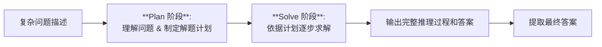

# Plan-and-Solve Prompting: Improving Zero-Shot Chain-of-Thought Reasoning by Large Language Models

## 1. 概览 Overview

### 1.1 个人预览 Personal Preview

> 针对大型语言模型在复杂推理任务上的零样本表现有限问题，本文提出了 Plan-and-Solve Prompting 策略，将问题求解分为 “计划（Plan）” 和 “求解（Solve）” 两个阶段。在回答问题前，模型会先生成解决问题的计划，再根据计划逐步推理得出答案。实验证明这一零样本提示方法能显著提高模型的推理准确率。相比传统的 Zero-shot CoT 方法，新策略有效减少了推理过程中的遗漏步骤和计算错误，使模型在无需示例的情况下达到接近 few-shot 提示的水平。

### 1.2 内容简介 Description

- **研究背景 Research Background：**  
LLM 在各类 NLP 任务中展现出强大的能力。然而，在需要多步推理的复杂任务上，直接让模型给出答案往往效果不佳。为此，研究者提出了思维链（Chain-of-Thought, CoT）提示，通过在提示中加入手工构造的逐步推理示例，引导模型生成中间推理步骤来提高答案准确率。随后，Kojima 等人提出了 Zero-shot CoT 方法，在不提供任何示例的情况下，仅在问题后附加一句 “Let’s think step by step” 来触发模型自行展开推理。Zero-shot CoT 尽管简单有效，但在实际应用中仍存在显著缺陷：模型生成的推理过程可能出现计算错误、缺失关键步骤以及语义理解偏差等问题。这些缺陷限制了零样本提示在复杂推理任务中的性能上限。

- **研究目标 Research Objectives：**  
文章旨在改进零样本链式思维提示策略，以克服 Zero-shot CoT 的上述不足。作者希望通过引入明确的 “计划” 阶段，减少模型推理过程中遗漏步骤的现象，并通过增加对计算和关键信息提取的指令，降低计算失误率，整体提升推理结果的准确性和可信度。目标是在无需提供示例的前提下，让提示本身更有效地指导模型完成复杂推理，从而在多步数学、常识和符号推理任务上接近甚至超越 few-shot 提示的表现。

- **主要贡献 Main Contributions：**  
&emsp;&emsp;(1) 提出了一种新的零样本提示策略 Plan-and-Solve（PS）Prompting：首先让模型针对问题制定计划，将复杂问题分解为若干子任务；然后再让模型按照计划逐步求解子任务，直至得出最终答案。该策略显式地将计划和求解分离，针对 Zero-shot CoT 中模型容易遗漏步骤的问题提供了解决方案。
&emsp;&emsp;(2) 设计了增强版的 PS+ 提示策略：在基本 Plan-and-Solve 提示的基础上，加入更详细的指令，包括要求模型 “提取相关变量及其对应数值”，“计算中间结果（注意准确计算和常识）” 等。通过增加这些针对性提示，PS+ 进一步减少了模型的计算错误，提升了推理过程的完整性与正确性。
&emsp;&emsp;(3) 在十个多步推理数据集上的实验验证了所提方法的有效性：包括算术、常识和符号推理三大类任务的基准。结果表明，Zero-shot PS 提示在所有数据集上均明显优于 Zero-shot CoT，且大多超过了另一种强零样本方法 Zero-shot Program-of-Thought（PoT）提示的表现；同时，Zero-shot PS+ 在数学推理任务上达到的准确率 可比拟有示例的 8-shot CoT 提示。这证明了精心设计的零样本提示有潜力缩小与 few-shot 提示之间的差距。

---

## 2. 关键信息 Key Information

### 2.1 核心思想与方法 Main Ideas & Methods

- **核心思想：**
为了减少推理过程中遗漏步骤的错误，Plan-and-Solve 提示要求模型在推理开始前先拟定解决思路，再按此思路求解。具体来说，模型被引导先产出一个包含分步计划的方案，然后根据该计划逐步解决问题，最后给出答案。这一策略等于让模型自己做 “规划”，从而确保复杂问题的求解过程更全面、不遗漏关键步骤。相比直接一步步思考（Zero-shot CoT），先计划后求解的思路能让模型对整体任务有全局把握，再执行时更有条理。

- **实现方法：**

和 Zero-shot CoT 一样，PS 提示模板首先将原问题与触发指令结合，然后结合推理文本生成最终结果，第一阶段格式如下：

```text
Q: [问题]
A: Let’s first understand the problem and devise a plan to solve the problem. Then, let’s carry out the plan and solve the problem step by step.
```

在模型生成完整的含推理过程和答案的输出后，再通过第二步 答案抽取提示（如 “Therefore, the answer (arabic numerals) is”）让模型提取最终答案用于评估。针对计算错误和遗漏信息，PS+ 提示 在上述基础上追加了更具体的指令，例如要求模型 “提取相关变量及数值” 以及 “计算中间结果” 等，从而督促模型不要遗漏题干中的重要信息，并仔细执行每一步计算。值得注意的是，这些附加指令显著提高了模型推理过程的质量，使其更加严谨。下图展示了 Plan 阶段和 Solve 阶段的大致流程：



上述 Plan-and-Solve 流程相对简单且通用，不需要额外训练模型，只通过修改提示语就实现了对推理过程的重新组织。相比一些需要模型多轮交互的复杂策略（如搜索不同解题路径的思维树 ToT），PS 提示仅用一次问答就完成计划与求解，因而开销更低，易于应用在各种大型语言模型推理场景中。

### 2.2 实验设置与结果 Experimental Settings & Results

- **实验设置 Experimental Settings：**  
作者在三个类别共十个数据集上评估了 Plan-and-Solve 方法的性能，包括 6 个算术推理（如 GSM8K、MultiArith 等）、2 个常识推理（CommonsenseQA、StrategyQA）和 2 个符号推理（Last Letter、Coin Flip）数据集。实验使用 OpenAI GPT-3（text-davinci-003）模型，在零样本设置下比较以下方法：传统直接推理（Zero-shot Direct）、Zero-shot CoT、PoT 以及本文提出的 PS 和 PS+ 提示策略。此外，还将 PS+ 与提供 8 个示例的 few-shot CoT 方法作对比，包括手工示例的 Manual-CoT 和自动挑选示例的 Auto-CoT。模型输出通过 Step1 推理+答案 和 Step2 抽取答案两步得到，每次生成使用贪心解码（temperature=0），另有实验探索了 Self-Consistency 多样性采样投票策略对结果的影响。

- **实验结果 Experimental Results：**  
实验结果显示，Plan-and-Solve 提示显著提升了模型的推理准确率：在算术推理方面，Zero-shot PS+ 在 6 个数据集上均全面超越 Zero-shot CoT，平均准确率提升超过 6%，在较复杂的 GSM8K 上也有 2.9% 的提高。与另一零样本强基线 PoT 相比，PS+ 在 5/6 个算术任务上表现更优。更令人瞩目的是，PS+ 的数学平均成绩（76.7%）已接近甚至超过提供示例的 few-shot 方法（Manual-CoT 77.6% 与 Auto-CoT 75.9%）。在常识推理任务中，PS+ 同样明显优于 Zero-shot CoT（例如 CommonsenseQA 准确率 71.9% vs 65.2%），但距离手工 few-shot 示例的上限尚有差距。在 Last Letter 等符号推理任务上，PS+ 更是取得了 75.2% 对 70.6% 的成绩，反超 手工 few-shot CoT；Coin Flip 任务中也达到 99.6% 的高准确率，几乎与 few-shot 表现持平。

此外，错误类型分析表明 PS 提示有效降低了推理过程中的遗漏和计算错误。对 GSM8K 错误案例的分类统计显示，Zero-shot CoT 的错误中有 12% 属于遗漏步骤，而 Zero-shot PS+ 将此比例降低到了 7%。类似地，计算错误率也从 7% 降至 5%。尽管语义理解类错误仍然存在，Plan-and-Solve 提示通过让模型预先梳理计划、关注关键变量，大幅提升了推理步骤的完整性和准确性。

## 3. 分析思考 Analysis & Thoughts

### 3.1 文章结论 Conclusions

- **零样本推理能力提升大有潜力：**
文章证明了通过改进提示设计，LLM 的零样本多步推理能力可以大幅提升。Plan-and-Solve 提示让模型显式制定计划并逐步求解，成功减少了推理过程中的疏漏和错误。在无需任何示例的情况下，模型的推理准确率逼近甚至达到 few-shot 提示的水平。这说明大型语言模型固有的推理潜力远未被简单提示充分挖掘，精心设计的触发语能让模型发挥出更强的推理能力。
- **提示工程极具重要性：**
Plan-and-Solve 的成功凸显了提示工程在引导模型行为方面的威力。相比直接要求模型 “一步步思考”，分阶段明确要求 “先计划再求解” 能产生更可靠的推理链。这启示我们在与 LLM 交互时，可以通过拆解任务、增加具体要求等方式来显著改善模型表现，而不必依赖额外训练数据或示例。特别是在推理任务上，设计合理的提示模板和指令集，可以在零样本条件下取得与 few-shot 相媲美的效果，为应用 LLM 解決实际复杂任务提供了低成本方案。

### 3.2 个人思考 Personal Thoughts

- 局限与改进空间：虽然 PS 提示降低了遗漏步骤和计算错误，但对语义理解错误并无明显改善。这表明模型在理解复杂问题方面仍有瓶颈，单靠提示可能不足以彻底消除这类错误。此外，Plan-and-Solve 提示需要模型自行规划，若模型对问题理解不充分，拟定的计划可能不完善，进而影响求解。因此未来可以考虑结合 ToT 等方法，在模型规划阶段引入搜索与评估机制，尝试多种思路以提高可靠性。
- 与其他方法对比： Plan-and-Solve 属于一次性完成计划和推理的提示策略，相较于 Least-to-Most 提示逐步细化子问题、逐个求解的过程，PS 方法更简洁但灵活性略低，适合结构明确的问题；而 ToT 通过系统地探索多个推理分支来提高解题准确率，尽管性能更高但交互成本也更大。PS 提示的优势在于无需多轮调用模型即可取得较好效果，未来或可将其与这些方法结合，如先用 PS 生成初步计划，再在关键步骤上应用 ToT 展开多种可能，从而兼顾效率和准确率。
- 自动提示优化：本文所用的提示语句（例如 “提取变量” 和 “计算中间结果” 等）主要靠人工经验设计。是否存在系统化的提示优化方法，自动发现针对不同任务的最佳触发语？后续工作可以尝试借助强化学习或大规模试验，从数据中学习生成有效提示，减少对人工的依赖。同时，不同模型对于同一提示的响应可能不同，如何为新模型快速定制最优的 Plan-and-Solve 提示也是一个实用问题。
- 扩展应用场景：Plan-and-Solve 思路本质上的这种规划先行的范式可推广到更多场景，引导模型先产出解决问题的步骤清单，再按清单执行，也能提升性能和结果的可解释性。

---

## 4. 关联文章 Related Works

- Chain of Thought Prompting
- CoT-SC
- Tree of Thoughts Prompting
- Zero-shot CoT
- Program of Thought Prompting
