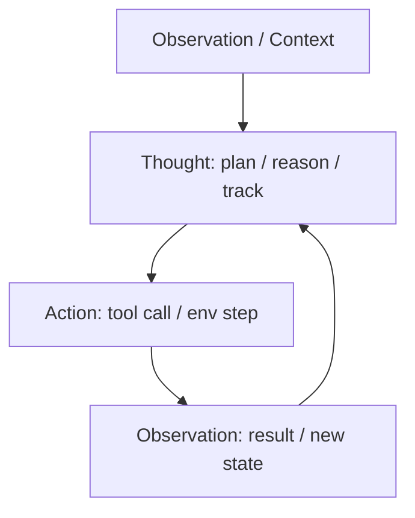

# ReAct: Synergizing Reasoning and Acting in Language Models

## 1. 概览 Overview

### 1.1 个人预览 Personal Preview

> ReAct 可看作是 “LLM Agent 时代” 的一个关键分水岭：它不再只让模型在文本里推理（CoT），也不只让模型照着环境反应式地输出动作（Act-only），而是把二者交错到同一条轨迹里，让模型边想边做、边做边补充信息。
这篇论文最核心的地方在于：它把一个看似朴素的提示格式（Thought / Action / Observation）做成了可迁移的方法论，并且在知识密集推理与交互式决策两个方向都给出了清晰的实验收益。更重要的是，ReAct 的轨迹天然可解释，人类可以直接在 “Thought” 层做轻量干预，这为后续的 Reflexion、工具调用型 Agent、以及各种 “LLM-as-a-controller” 提供了基础积木。

### 1.2 内容简介 Description

- **研究背景 Research Background：**
论文指出，语言模型在两类能力上都很强，但常被分开使用：
&emsp;&emsp;(1) **推理（Reasoning）**：例如思维链（CoT）提示能显著提升多步推理，但推理过程是封闭的，无法主动接入外部知识，容易出现事实幻觉与错误传播。
&emsp;&emsp;(2) **行动（Acting）**：近年的工作把环境观测转成文本，让 LLM 直接输出动作与环境交互，但往往缺少显式的高层计划与工作记忆，难以稳定完成长程任务。

- **研究目标 Research Objectives：**
提出一种通用范式，让 LLM 在求解过程中能够：
&emsp;&emsp;(1) 通过内部语言推理来规划、跟踪、纠错；
&emsp;&emsp;(2) 同时通过对外部环境的行动来检索信息、更新状态；
&emsp;&emsp;(3) 并在不同任务（知识密集推理、交互式决策）上带来系统性提升与更强可解释性。

- **主要贡献 Main Contributions：**
&emsp;&emsp;(1) 提出 ReAct：在一个统一的提示轨迹中交替生成 Thought（推理）与 Action（行动），并接收环境 Observation（观察）反馈。
&emsp;&emsp;(2) 在 HotpotQA 与 FEVER 上展示：ReAct 更 “grounded”，能减少幻觉；进一步与 CoT-SC 结合可取得更强表现。
&emsp;&emsp;(3) 在 ALFWorld 与 WebShop 上展示：仅用 1–2 个示例的 prompting，就能显著提升成功率，并超过部分模仿学习 / 强化学习基线。
&emsp;&emsp;(4) 提供可解释轨迹与 human-in-the-loop 纠错示例，说明推理痕迹不仅是 “解释”，也可以作为 “控制接口”。

---

## 2. 关键信息 Key Information

### 2.1 核心思想与方法 Main Ideas & Methods

- **核心格式：Thought / Action / Observation 的交替轨迹**
ReAct 把 LLM 的输出拆成两种 token-level 模式：
  - **Thought**：模型的内部推理与计划，用于分解子目标、记录进展、从观测中提炼关键信息、以及遇到异常时调整策略。
  - **Action**：面向外部接口的可执行动作，如 Search、Lookup、Finish（问答场景），或游戏 / 网页环境中的具体操作。
  - **Observation**：环境对 Action 的响应，作为下一轮 Thought 的输入。

下面这张图给出了 Standard / CoT / Act-only / ReAct 的对比，并在 HotpotQA 与 ALFWorld 里展示了 ReAct 轨迹长什么样（重点看右上与右下的 ReAct 轨迹）。

- **“推理 + 行动” 协同**
  - 推理帮助行动：Thought 让模型更容易形成计划与工作记忆，避免在长序列里迷失或重复试错。
  - 行动帮助推理：Action 让模型通过检索或环境交互获取新信息，减少纯文本推理时的幻觉与过时知识问题。

- **与 CoT-SC 的组合策略**
论文发现：ReAct 更 “grounded”，但有时 CoT-SC（自洽采样后投票）能给出更好的最终综合答案。因此作者提出两种启发式混合：
  - **ReAct → CoT-SC**：当 ReAct 在若干步内无法给出答案时，切换到 CoT-SC；
  - **CoT-SC → ReAct**：当 CoT-SC 的多数答案不够一致时，切换到 ReAct 去做检索与基于证据的推理。
这本质上是在同一任务里动态选择 “内部推理” 与 “外部交互” 的占比。

- **用 mermaid 复述 ReAct 循环（方便复用到 Agent 系统）**

### 2.2 实验设置与结果 Experimental Settings & Results

- **知识密集推理：HotpotQA 与 FEVER（Table 1）**
论文在 PaLM-540B 上比较了 Standard、CoT、CoT-SC、Act、ReAct 以及混合策略。表格中可以看到：
- 在 FEVER 上，ReAct（60.9）高于 Act（58.9）与 CoT（56.3）。
- 在 HotpotQA 上，ReAct（27.4）略低于 CoT（29.4），但混合策略 **ReAct → CoT-SC** 达到 35.1，为表中最好。
- 同时给出监督学习 SOTA 作为参照（HotpotQA 67.5 / FEVER 89.5），用于体现 prompting 方法与全监督训练之间的差距。

- **交互式决策：ALFWorld 与 WebShop（Table 3 & 4）**
在决策任务里，ReAct 的优势更直观：
- **ALFWorld**：最佳 ReAct 试验（best of 6）总体成功率为 71，而 Act-only 的最佳试验为 45。
- **WebShop**：ReAct 的成功率（SR）为 40.0，高于 Act-only 的 30.1；并且在 score 指标上也更高（66.6 vs 62.3）。

- **不同大模型上的一致性：PaLM-540B vs GPT-3（Table 5）**
论文还做了补充实验来说明 ReAct prompting 对不同大模型也有效：在同一套设置下，GPT-3（text-davinci-002）在 HotpotQA 与 ALFWorld 上的数字都高于 PaLM-540B（例如 ALFWorld 78.4 vs 70.9）。

---

## 3 分析思考 Analysis & Thoughts

### 3.1 文章结论 Conclusions

- ReAct 证明了一个关键点：**LLM 的推理能力与行动能力不是互斥的**。在统一轨迹中交替生成 Thought 与 Action，可以同时提高任务性能与可解释性。
- 在知识密集推理任务上，ReAct 借助外部检索让推理更 grounded，减少幻觉与错误传播；在交互式决策任务上，ReAct 通过稀疏但高价值的推理步骤显著提升成功率。
- ReAct 的 “可见推理” 还带来额外价值：人类可以直接编辑 Thought 来纠错，从而在不重新训练模型的情况下实现 human-in-the-loop 控制。

### 3.2 个人思考 Personal Thoughts

ReAct 把 LLM 的推理过程变成了一个可插拔的控制层。后来很多 Agent 系统（工具调用、网页导航、代码代理）其实都在复用这条轨迹结构。

- **可能存在的问题：**
&emsp;&emsp;(1) Thought 可能出现 “自信的胡说”，导致后续 Action 被误导；
&emsp;&emsp;(2) tool call 的空间一旦变复杂（多工具、多约束、多模态），仅靠 few-shot 的格式约束可能不够，需要更强的结构化约束与验证。
- **改进点：**
&emsp;&emsp;(1) 引入 Self-Refine / Reflexion 式的反馈回路：失败后总结错误并写入记忆，让 ReAct 不仅能解释，还能自我提升。
&emsp;&emsp;(2) 在关键动作前加一个轻量验证器（例如规则校验或小模型 critic），避免 “错误 Thought → 错误 Action” 的级联。
&emsp;&emsp;(3) 对 Action 做类型系统与参数校验，把自由文本动作收敛成更可靠的结构化调用。

---

## 4. 关联文章 Related Works

- Chain of Thought
- Self-Asking
- Function Calling
- Reflexion
- Self-Refine
