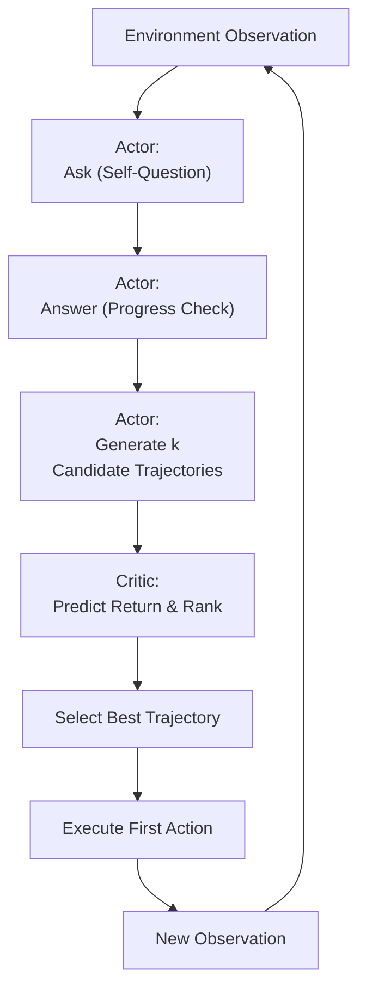

# Prospector: Improving LLM Agents with Self-Asking and Trajectory Ranking

## 1. 概览 Overview

### 1.1 个人预览 Personal Preview

> 这篇论文针对基于 LLM 的智能体难以利用环境反馈优化决策的问题，提出了名为 Prospector 的新方法。Prospector 通过引入自我提问（Self-Asking）的提示步骤和轨迹排序（Trajectory Ranking）机制，将一个大型 LLM “演员（Actor）” 与一个较小的 LLM “评论员（Critic）” 结合，鼓励智能体在每步行动前进行自我检查，并生成多个可能的行动序列，由评论员预测哪个序列最有可能成功。实验表明，该方法在 ALFWorld 和 WebShop 等复杂交互决策任务中显著提高了任务成功率，超越了现有的先进方法如 ReAct 和 Reflexion。作为读者，我感到这种将提示推理与价值评估相结合的思路非常新颖，启发了我思考如何进一步提高 LLM 智能体在复杂环境中的适应和规划能力。

### 1.2 内容简介 Description

- **研究背景 Research Background：**
LLM 被用作自主智能体，已经能通过少样本提示学习（ICL）在无需训练的情况下解决交互式决策任务，例如经典的 ReAct 方法。然而，基于提示的智能体无法根据环境反馈来优化行动序列；换言之，当行动失败时，它们缺乏利用奖励信号改进策略的机制。近期也出现了一些基于微调训练（FT）的智能体（如 Fine-tuned ReAct 变体 FireAct、强化学习策略 ETO 等），通过在环境交互数据上训练模型来提升特定任务性能。但纯微调方法往往缺乏通用性，需要大量训练并可能过拟合特定环境。研究社区希望找到一种折中的方案，既保持大模型强大的通用决策能力，又能够有效利用环境反馈来改进决策。

- **研究目标 Research Objectives：**
文章旨在提升基于 LLM 的自主智能体在交互式决策任务中的性能，具体目标包括：
&emsp;&emsp;(1) 设计一种方法使智能体在不额外训练超大模型的前提下，能够利用环境反馈信息改进决策。
&emsp;&emsp;(2) 通过引入自我反思 / 提问机制，缓解传统 ReAct 提示在决策过程中出现的幻觉和不相关动作问题。
&emsp;&emsp;(3) 验证该方法在不同复杂环境下（如实体操作环境 ALFWorld、网络购物环境 WebShop）对任务成功率的提升幅度，并与现有方法（ReAct、Reflexion 等）进行对比。

- **主要贡献 Main Contributions：**
文章主要贡献如下：
&emsp;&emsp;(1) 提出 Prospector 智能体框架，引入互补的双 LLM 架构：一个大型 LLM 作为决策执行的 Actor，以及一个较小的 LLM 作为评估反馈的 Critic。这一设计结合了少样本提示的灵活性和微调模型利用环境信号的优势，弥补了纯 ICL 和纯 FT 方法各自的不足。
&emsp;&emsp;(2) 提出 AskAct 提示策略，即在 ReAct 提示范式的基础上增加自我提问步骤。在每次观察到环境信息后，LLM Actor 先询问自身当前目标是否达成、进度如何，并回答该问题，然后再决定下一步行动。这种插入的自问自答步骤可以减轻幻觉，引导模型产生与任务目标更契合的动作。
&emsp;&emsp;(3) 提出轨迹排序机制，即让 LLM Actor 在每个决策点以较高随机性生成多种可能的动作序列（trajectory），由 LLM Critic 对每条序列进行奖励预测并排序，选出最有希望成功的序列。LLM Critic 可以通过少样本提示或在少量轨迹数据上微调来具备评估序列成功率的能力，从而在不直接查询环境真实奖励的情况下，隐式地利用环境反馈信号。
&emsp;&emsp;(4) 在 ALFWorld 和 WebShop 基准环境上进行了实证评估。结果显示，Prospector 的成功率相比基线有显著提升：在 ALFWorld 中，Prospector 将 GPT-3.5 驱动智能体的成功率从约 77.6% 提高到 91.0%，超过引入多次反思的 Reflexion 方法的 86.0%；在 WebShop 上也从约 36% 提升到约 43%，接近人类平均水平。这些结果证明了自我提问和轨迹排序对增强 LLM 智能体决策能力的有效性。

---

## 2. 关键信息 Key Information

### 2.1 核心思想与方法 Main Ideas & Methods

- **整体架构：**
Prospector 将智能体解构为两个协作的模块：LLM Actor 和 LLM Critic。LLM Actor 负责与环境交互、生成动作；LLM Critic 则对动作序列进行评估打分。Actor 选择一个参数规模很大的预训练模型（如 GPT-3 175B 或 Llama 2 70B）以利用其强大的推理和泛化能力，而 Critic 则采用相对较小的模型（如数 B 参数量级）并可以针对特定环境微调用于奖励预测。这种大小模型搭配确保了既不损失大模型的通用性，又引入了通过小模型学习环境反馈的能力。

- **AskAct 提示策略：**
Prospector 的 Actor 在决策时使用改进的提示模板 AskAct。相较于原始 ReAct 提示（Observation → Thought → Action），AskAct 在每个观察与行动之间增加了自我提问步骤。具体做法是：在 Few-shot 示例中演示，当观察到某些环境信息时，先由智能体自问一个与当前任务目标相关的问题并回答，然后再给出行动。例如在 ALFWorld 的任务 “把喷雾瓶放到厕所” 中，当看到观察 “你找到了喷雾瓶” 时，Agent 会先问自己“我找到喷雾瓶了吗？”并回答“找到了”，再执行“拿起喷雾瓶”动作。这个自问自答过程相当于让模型检查目标达成情况，从而避免在目标未满足时就贸然行动的错误。作者指出，AskAct 有助于缓解动作选择中的幻觉，诱导模型产生更准确的下一步行动。

- **Trajectory Ranking 轨迹生成与排序：**
Prospector 的另一核心是让 Actor 一次性生成多种可能的行动方案，再由 Critic 挑选最优方案。具体而言，Actor 在每个决策点不会只输出单一步骤动作，而是以较高随机性（如增大 sampling temperature 到 0.8）生成多个不同的完整轨迹（从当前状态开始的一系列后续动作，直到任务完成或步骤耗尽）。这些候选轨迹体现了模型对任务的不同解法构想。然后，Critic 对每条候选轨迹估计一个预期总奖励 $\hat{R}$（例如任务成功概率或最终得分），并将轨迹按评分高低排序。Critic 的评估可以通过 Few-shot 提示（在提示中提供成功 / 失败轨迹示例，让其判断新轨迹的结果）实现；在复杂环境下，作者也探索了监督微调 Critic 的方式，以提高奖励预测准确度。最终，Agent 选择评分最高的轨迹，执行其中的首步行动与环境交互，然后进入下一个决策循环。如此一来，智能体在每一步都进行 “思考多种可能 → 评估选择” 的决策，更有望朝成功方向探索。Critic 的评分机制使环境的奖励信号在无需反复试错的情况下被隐含地纳入决策：Critic 相当于一个学到的价值函数，指导 Actor 从多种想法中选择最优行动。

- **训练与实现细节：**
在不需要额外训练 Actor 的前提下，Critic 的性能对整体方法很关键。作者发现对于相对简单的 ALFWorld 环境，即使使用 GPT-3.5 等 API 大模型通过 2-shot 提示来评估轨迹成败，准确率已足够指导选择。但在更复杂的 WebShop 环境中，仅靠 Few-shot 的 GPT-3.5 对回报高 / 中 / 低的判断准确率不足，因此作者收集了约 12K 条轨迹数据，微调开源小模型（如 Llama 2 7B、FLAN-T5 3B 等）作为 Critic。微调后 Critic 的回报预测准确率显著提升，从而进一步提高 Prospector 在复杂环境中的决策表现。

### 2.2 实验设置与结果 Experimental Settings & Results

- **实验设置 Experimental Settings：**
作者在两个具有代表性的决策环境上评估 Prospector：
&emsp;&emsp;(1) ALFWorld：文本化家庭活动环境，任务为把物品从某处拿起并放到另一处等。评估使用 ALFWorld 提供的 134 个未见任务作为测试集。
&emsp;&emsp;(2) WebShop：网络购物环境，Agent 接受购物指令，通过搜索、浏览、点击等文本动作找到合适商品加入购物车。评估使用官方 500 条测试指令。
Prospector 的 Actor 使用 `text-davinci-002`（近似 GPT-3.5）或 Llama 2 70B；Critic 使用 Few-shot 的 API 模型，或微调的开源小模型。基线包括 ReAct、Reflexion，以及文献中的 IL、IL+RL、PPO、ETO 等方法。

- **实验结果 Experimental Results：**
&emsp;&emsp;(1) 在 ALFWorld 上，Prospector 将 GPT-3.5 驱动的成功率提升至 91.0%，显著高于 ReAct（约 77.6%）与 Reflexion（约 86.0%）。对 Llama 2 70B 这类开源 Actor，Prospector 也带来更大幅提升（从约 41.0% 提升到约 86.6%）。
&emsp;&emsp;(2) 在 WebShop 上，Prospector 将 GPT-3.5 驱动的成功率从约 35.8% 提升至约 41.4%；进一步使用微调 Critic 可达约 43.0%，缩小与人类约 50.0% 成功率的差距。
这些结果表明：AskAct 能提高单步决策质量，Trajectory Ranking 能弥补 LLM 缺乏试错调参的弱点，两者结合能显著提高交互式决策任务成功率。

---

## 3. 分析思考 Analysis & Thoughts

### 3.1 文章结论 Conclusions

- **能力提升与方法有效性：**
文章结论强调，引入自我提问与轨迹排序能显著提升 LLM 智能体在复杂交互任务中的成功率。Prospector 证明了即使不微调超大模型本身，也可以通过提示设计与辅助模型来弥补决策弱点。
- **方法意义：**
Prospector 将大型预训练模型的推理优势与小模型的学习反馈优势结合，兼顾通用性与针对性。这种 “Actor-Critic” 思路与强化学习的价值评估概念相通，但在纯提示范式下实现了类似效果，推动了 LLM Agent 领域将链式思考与评价函数融合的新范式。
- **局限与挑战：**
Prospector 的效果依赖 Critic 的奖励预测能力。在环境复杂且缺乏轨迹数据时，Few-shot Critic 可能不足，需要额外微调。其次，多轨迹生成与筛选会显著增加推理成本，实际应用需要权衡性能与成本。

### 3.2 个人思考 Personal Thoughts

- **方法优势与启发：** Prospector 的价值在于让 LLM 在行动前先 “想多种可能，再选最优”。AskAct 的自我检查看似简单，但抓住了任务执行中随时校准目标的关键点。Trajectory Ranking 则让我联想到传统 AI 中的规划搜索与价值函数：LLM 通过有限的多方案扩展，就能筛掉大量差方案，显著提高成功率。

- **潜在改进方向：** 可能的改进包括：让 Critic 不仅排序，还给出可解释的失败原因，帮助 Actor 对候选轨迹进行局部修正；将 Prospector 与 Reflexion 结合，形成执行中持续自适应的闭环；以及从工程角度，训练更轻量的策略与评估器来减少多次大模型采样带来的成本。

---

## 4. 关联文章 Related Works

- ReAct
- Reflexion
- AutoGPT
- Tree of Thoughts
- AdaPlanner
