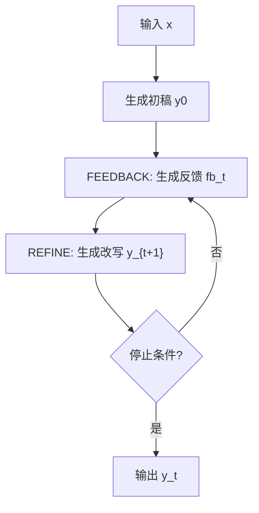

# Self-Refine: Iterative Refinement with Self-Feedback

## 1. 概览 Overview

### 1.1 个人预览 Personal Preview

> 这篇论文回答了一个非常工程也非常根本的问题：“LLM 第一次生成的结果经常还差一点，能不能像人类写作一样自己改自己？”
作者提出的 Self-Refine 很朴素：同一个 LLM 先产出草稿，再给草稿写反馈（指出哪里不好、怎么改），再根据反馈改写，反复迭代，直到达到停止条件。整个过程不需要额外标注数据、不需要训练、不需要强化学习，而是纯推理时策略（test-time strategy）。
Self-Refine 把 “自我批改” 明确拆成 FEEDBACK → REFINE 两步，并且强调反馈要 “具体、可执行（actionable）”，这让方法可复制、可落地。
Self-Refine 用同一套框架覆盖了对话、代码、数学推理、受限生成等 7 个任务，证明这不是某个任务的巧招，而是一个更通用的推理时增强范式。

### 1.2 内容简介 Description

- **研究背景 Research Background：**
强大的 LLM 往往能生成可读的初稿，但在多目标或目标难以形式化的任务上（例如对话要 “更懂用户”、代码要 “更可读 / 更高效”），初稿常常不够好。以往提升生成质量的手段，常依赖外部监督（人工反馈、奖励模型、额外训练数据）或专门训练一个 “改写模型”，成本高且不总是可得。Self-Refine 的出发点是：既然模型能写初稿，也许它也能像审稿人一样指出问题，并据此自我改写。

- **研究目标 Research Objectives：**
&emsp;&emsp;(1) 提出一个无需训练、无需额外数据、可复用于多任务的推理时自我改进框架。
&emsp;&emsp;(2) 让“自我反馈”不仅是泛泛评价，而是能真正驱动改写的可执行反馈。
&emsp;&emsp;(3) 在多类任务与多种强基座模型（GPT-3.5 / ChatGPT / GPT-4）上验证：这种推理时迭代能带来稳定增益，且即便 GPT-4 也仍可提升。

- **主要贡献 Main Contributions：**
&emsp;&emsp;(1) 提出 Self-Refine：用同一个 LLM 交替执行 FEEDBACK 与 REFINE，在推理阶段迭代提升输出质量。
&emsp;&emsp;(2) 给出清晰的形式化：初稿、反馈、改写与历史拼接（把过去轮次的输出与反馈追加到提示里），并讨论停止条件的设计。
&emsp;&emsp;(3) 在 7 个任务上做了系统实验，显示相对 “一次生成” 有显著提升，平均约 20% 绝对增益；并展示即便 GPT-4 也仍能通过该方法改进。
&emsp;&emsp;(4) 做了反馈质量消融：具体可执行反馈优于泛泛反馈，也优于 “无反馈只迭代改写”，强调了 FEEDBACK 步骤的关键性。

---

## 2. 关键信息 Key Information

### 2.1 核心思想与方法 Main Ideas & Methods

- **整体框架：用同一个模型，分角色轮转**
Self-Refine 把同一个 LLM 视为模型 \(\mathcal{M}\)，在推理时依次扮演三个角色：
&emsp;&emsp;(1) 生成器：先给出初稿 \(y_0\)。
&emsp;&emsp;(2) 反馈者：对当前输出 \(y_t\) 给出反馈 \(fb_t\)。
&emsp;&emsp;(3) 改写者：根据反馈把 \(y_t\) 改写为 \(y_{t+1}\)。

- **三类提示：\(p_{gen}\)、\(p_{fb}\)、\(p_{refine}\)**
方法依赖 3 套 few-shot 提示：
&emsp;&emsp;(1) \(p_{gen}\)：告诉模型如何从输入 \(x\) 生成初稿。
&emsp;&emsp;(2) \(p_{fb}\)：告诉模型如何对 \(x, y_t\) 写出反馈 \(fb_t\)。
&emsp;&emsp;(3) \(p_{refine}\)：告诉模型如何基于 \(x, y_t, fb_t\) 生成改写 \(y_{t+1}\)。

- **关键公式与 “带历史” 的改写**
反馈步骤可写为：\(fb_t = \mathcal{M}(p_{fb} \Vert x \Vert y_t)\)。
改写步骤的基础形式是：\(y_{t+1} = \mathcal{M}(p_{refine} \Vert x \Vert y_t \Vert fb_t)\)。
但论文强调一个很重要的工程细节：把历史轮次的输出与反馈拼进提示，让模型“记住之前改过什么”，避免反复横跳：
\[
y_{t+1} = \mathcal{M}(p_{refine} \Vert x \Vert y_0 \Vert fb_0 \Vert \dots \Vert y_t \Vert fb_t)
\]

- **停止条件：上限 + 任务特定信号**
论文给出两类停止方式：
&emsp;&emsp;(1) 固定迭代步数上限（实验里最多 4 轮）。
&emsp;&emsp;(2) 让反馈里输出一个 “停止指示”（例如 stop score），由任务规则决定是否停止。

- **强调 actionable feedback**
Self-Refine 的反馈不是 “不错 / 一般” 这种评价，而是要指出 “具体问题 + 可操作” 的修改建议。论文的消融表明：具体反馈优于泛泛反馈，也优于没有反馈只做多轮改写。直觉上，反馈越具体，改写的梯度越明确。

- **论文中的直观示例**
图中展示了对话与代码两个例子：对话例子里，反馈指出 “回复不够 engaging、没理解用户需求”，改写后补充了运动特点并追问用户意图；代码例子里，反馈指出 “暴力循环很慢，建议用求和公式”，改写后变成 \(n(n+1)/2\)。

### 2.2 实验设置与结果 Experimental Settings & Results

- **任务与模型设置**
论文评估了 7 个任务：Dialogue Response Generation、Code Optimization、Code Readability Improvement、Math Reasoning、Sentiment Reversal，以及两个新增任务 Acronym Generation 与更难版本的 Constrained Generation（关键词约束从 3–5 扩到 20–30）。
基座模型覆盖 GPT-3.5（text-davinci-003）、ChatGPT（gpt-3.5-turbo）与 GPT-4；代码相关任务还实验了 Codex。为了对齐不同模型的行为，作者即便对 ChatGPT / GPT-4 也使用 few-shot 的 FEEDBACK 与 REFINE 提示，并将最大迭代轮数设为 4。

- **主要结果**
Table 1 总结了 7 个任务在 3 个基座模型上的结果：Self-Refine 在所有任务上都提升。提升幅度因任务而异：
&emsp;&emsp;(1) 对话生成（Dialogue Response）：GPT-4 从 25.4 提升到 74.6（↑ 49.2）。
&emsp;&emsp;(2) 受限生成（Constrained Generation）：GPT-4 从 15.0 到 45.0（↑ 30.0）。
&emsp;&emsp;(3) 情感反转（Sentiment Reversal）：ChatGPT 从 11.4 到 43.2（↑ 31.8）。
&emsp;&emsp;(4) 数学推理（Math Reasoning）：提升相对小（例如 GPT-4 92.9 到 93.1，↑ 0.2），论文解释为模型很难从自身推理链中可靠识别细微错误。

- **反馈质量消融**
论文比较了三种条件：
&emsp;&emsp;(1) 具体可执行反馈（Self-Refine 默认）；
&emsp;&emsp;(2) 泛泛反馈（generic feedback）；
&emsp;&emsp;(3) 无反馈只迭代改写（no feedback）。
结论是：即便泛泛反馈也有帮助，但可执行反馈最好；某些任务在无反馈时几乎无法工作，说明 FEEDBACK 不是可有可无的装饰，而是驱动性能提升的关键机制。

---

## 3 分析思考 Analysis & Thoughts

### 3.1 文章结论 Conclusions

- **核心结论：**
通过推理阶段的 FEEDBACK → REFINE 迭代，LLM 可以在不改变参数、不引入额外监督数据的前提下，显著提高多任务输出质量；平均带来约 20% 的绝对提升，并且即便 GPT-4 也仍存在可被“自我改写”挖掘出来的提升空间。

- **方法意义：**
Self-Refine 把 “改答案” 这件事从训练范式（RLHF、奖励模型、微调）拉回到推理范式。它是一种通用的 test-time boosting 思路，可作为现有系统的 “外挂式增强”。同时它也提供了一个可组合模块，未来可以替换反馈来源（外部工具、人类、评审模型），或替换停止规则（更精细的自动验证）。

### 3.2 个人思考 Personal Thoughts

Self-Refine 特别适合“目标较软、评价难写成规则”的任务：对话更贴心、文章更流畅、代码更可读、摘要更覆盖要点等。因为这些任务里，**“指出问题” 往往比 “直接一次写对” 更容易**，而 Self-Refine 把这个优势显式化了。
Self-Refine可能存在以下两个风险：
&emsp;&emsp;(1) 成本与时延：每次输出可能要多次调用大模型，线上系统需要精细的停止策略（例如早停）与预算控制。
&emsp;&emsp;(2) 自评偏差：模型可能会 “自信地错”，给出看似合理但不对的反馈，导致改写朝错误方向走。论文也显示数学推理提升有限，这可能正是自评难点的体现。

- **可能的改进方向**
&emsp;&emsp;(1) 引入外部可验证信号：例如对代码运行测试、对数学答案做校验，让 stop 指示与反馈更可靠。
&emsp;&emsp;(2) 多样化反馈：同一个输出让模型从多个维度写反馈（正确性、覆盖、风格等），再融合成更强的改写指令。
&emsp;&emsp;(3) 轻量化：用小模型产生反馈，大模型做改写，或只对高风险问题触发 Self-Refine。

---

## 4. 关联文章 Related Works

- CoT-SC
- Reflexion
