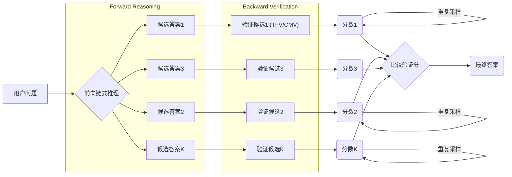

# Large Language Models are Better Reasoners with Self-Verification

## 1. 概览 Overview

### 1.1 个人预览 Personal Preview

> 为了解决大型语言模型 (LLM) 在思维链 (CoT) 中易受错误累积影响的问题，本文提出了让模型对自身推理结果进行自我验证的方法。具体做法是先由 LLM 通过 CoT 生成多个候选答案，然后将每个候选作为结论反过来验证原问题条件是否成立，从而为每个答案计算一个验证分数，最终选取分数最高者作为输出。该方法无需额外训练验证模型，即可让 LLM 自动检查并纠正自己的推理，有效提高了算术、常识和逻辑推理任务的准确率。

### 1.2 内容简介 Description

- **研究背景 Research Background：**
CoT 提示可以引导 LLM 逐步推理，从而在算术、常识、逻辑等任务上取得出色表现。然而，CoT 的多步骤生成对单步错误极为敏感，细微失误可能导致整条推理链偏差，最终答案错误。已有工作尝试训练独立的验证模型来判断答案正确性，但这需要大量人工标注和额外模型训练，而且输出的置信分数往往缺乏可解释性。因此，需要一种无需额外监督又能让模型自行检查并校正推理错误的机制。
- **研究目标 Research Objectives：**
文章旨在验证并利用 LLM 的 “自我验证” 能力来提升推理可靠性。核心目标是在模型给出初步结论后，设计一种让模型回过头检查结论正确与否的方法，从而筛选出更准确的答案。这一方法应避免额外数据和 fine-tuning，直接通过提示引导模型自我评估，以提高各种类型推理任务的性能。
- **主要贡献 Main Contributions：**
&emsp;&emsp;(1) 提出并证明了 LLM 的确具备自我验证推理结果的能力，设计了一个无需训练外部验证器即可给出可解释验证分的框架。
&emsp;&emsp;(2) 在多个数学、常识、逻辑推理数据集上进行广泛实验，结果相比原始 CoT 基线有显著提升。
&emsp;&emsp;(3) 针对不同任务特性提出了两种自我验证策略：面向通用问答的真值判断（TFV）和针对算术问题的条件遮蔽验证（CMV）。该方法适用于多种推理场景，表明 “自验证” 有望成为继预训练和提示学习之后提升 LLM 推理能力的新范式。

---

## 2. 关键信息 Key Information

### 2.1 核心思想与方法 Main Ideas & Methods

- **核心思想：**
模型通过先思考再反思来提高答案准确率，即将前向链式推理与后向自我验证相结合。首先利用 CoT 生成一系列解题步骤和候选答案，然后模型扮演检查者角色，对每个候选答案进行验证推理，以判断该答案是否真正符合原问题条件。这种自检机制可以发现并避免因单步失误导致的错误累积，使最终答案更可靠。

- **实现方法：**
整体流程分为两阶段：（1）前向推理 (Forward Reasoning)：给定问题，使用 Few-Shot CoT 提示让 LLM 生成详细解题过程和答案。通过随机采样生成 $K$ 个不同的候选解答，确保答案多样性emergentmind.com
。（2）后向验证 (Backward Verification)：将每个候选答案与原问题整合成一个陈述句作为“结论”。然后根据任务类型选择验证策略：
  (a) 真值判断 (True-False Verification, TFV)：针对常识、逻辑等一般任务，将问题所有已知条件和候选结论放在一起，直接询问模型“上述条件是否自洽正确（True 或 False）？”。模型需判断该结论与前提是否矛盾，以 True/False 表示正确性。
  (b) 条件遮蔽验证 (Condition Mask Verification, CMV)：针对数学算术问题，将题干中的关键信息（如数字量）逐一用占位符 “X” 遮蔽，并在包含候选答案的前提下要求模型推回被遮蔽的值。例如，把题目改写为方程：“Jackie 比 Adam 多 X 个苹果，X 等于多少？”，由模型根据候选答案反推 $X$ 应为多少。如此检测候选答案是否使原条件成立。
  上述验证提示均引导 LLM 再次展开链式推理求解，被遮蔽条件或真值判断会经由模型的推理过程得出。

验证分数计算： 为提高区分度，每个候选答案的验证过程重复采样多次。对于 TFV，统计模型判断 “True” 的次数作为该答案的评分；对于 CMV，比对模型回推结果与原始遮蔽值，一次匹配记一分。多次重复后得到每个候选的总分。最后选择验证分最高的答案作为模型最终输出。这种评分源自对推理步骤一致性的评估，而非一个黑盒分类器的置信度输出，因而更具解释性。

### 2.2 实验设置与结果 Experimental Settings & Results

- **实验设置 Experimental Settings：**
作者在算术推理（如 GSM8K、SingleEq、AddSub 等数学文字题）、常识推理（CommonsenseQA 等）和逻辑推理（日期推理等）共 8 个数据集上评估了该方法。选用 GPT-3 系列 175B 模型（包括 code-davinci-001 和较新指令微调的 code-davinci-002）作为基础推理模型。比较基线包括直接 CoT 推理、Self-Consistency (SC) 多样性解码、以及要求模型调用 Python 程序的 PAL 方法。在 few-shot 提示下，模型对每个问题生成多个解答并应用自我验证筛选答案。主要度量是问题解答正确率（solve rate）。

- **实验结果 Experimental Results：**
自我验证策略在各类任务上均显著提高了模型推理正确率。以经典算术基准 GSM8K 为例，使用 CoT 时 GPT-3.5 模型正确率仅约 60.8 %，加入自我验证后提升到接近 78 %。在 SingleEq 等简单方程任务上甚至达到 96–99 % 的高水平。对于常识和逻辑问答，尽管提升幅度相对略小，但自我验证仍有效纠正了一部分 CoT 谬误，提高了整体准确度。另外，将本方法与前向解码增强策略结合，效果更加出色：例如 Self-Consistency 本身能改善答案质量，而 SC + 自我验证 进一步提升了弱模型的表现，使 InstructGPT 在 MultiArith 数字推理上从 96.1 % 上升到 100 %。总体来看，自我验证为各规模模型均带来了稳健的增益，验证了 LLM 在无需额外监督信号下自行评估答案的可行性。

---

## 3 分析思考 Analysis & Thoughts

### 3.1 文章结论 Conclusions

- **自我验证提升推理可靠性：**
本文证明了大型语言模型可以通过自我验证机制有效降低链式思维推理中的错误累积问题，提高最终答案的准确性。这种不依赖外部监督的验证方法，充分挖掘了模型自身的推理潜力，让 LLM 在给出答案的同时评估其正确性，从而显著提升了算术、常识、逻辑等多领域任务的表现。实验结果显示，自我验证可作为通用后处理模块，拓展了现有 CoT 提示范式，在不改变模型参数的情况下带来可观性能增益。
- **意义与展望：**
自我验证为提高 AI 推理可信度提供了一条新思路。作者指出，该方法有望发展为继预训练、提示学习之后的“第三阶段”——即自验证范式。未来模型训练和推理流程可以显式加入验证环节，促使模型自主检查和修正推理过程，从而增强可靠性和可解释性。此外，更复杂场景下的推理（如代码合成、常识推理中的隐含假设检验等）也可尝试融合自我验证策略，探索 LLM 更深层的自我反思能力。

### 3.2 个人思考 Personal Thoughts

- 方法局限与适用范围：自我验证依赖模型本身的知识和推理能力来发现错误，对于模型尚未掌握的领域知识或题目，验证过程可能无法奏效。此外，该方法需要生成和评估多个解答，推理成本较高，在交互式应用中可能受限于效率。不过，随着模型推理速度和质量的提升，这种多解答自检机制在许多关键场景（如医学问诊中的决策检查）仍具实用价值。
- 对比其它策略：相比 CoT-SC 通过多数投票选答案、Step-Aware Verifier 训练额外模型逐步判别对错，自我验证直接利用 LLM 自身反馈来打分，既不需要新数据也保留了推理透明度。它在少样本和无监督情况下表现尤为突出。未来或可将这些方法结合，例如在 ToT 搜索中引入自我验证评估分支优劣，从而进一步提升复杂推理任务的成功率。
- 潜在改进方向： 可以考虑提升验证提示的设计，使模型更敏感地捕捉逻辑不一致之处。例如，引导模型在验证时对每一步推理逐条检查（类似逐步 CoT 批改自己的过程），或引入对比验证（让两个模型互相验证对方的结论）。另外，将自我验证应用于生成式任务（如摘要真实性检查）也是值得探索的方向，让模型在输出文本后再检视其内容是否前后一致、符合事实。

---

## 4. 关联文章 Related Works

- Zero-shot CoT
- Auto CoT
- CoT-SC
- Chain of Thought
