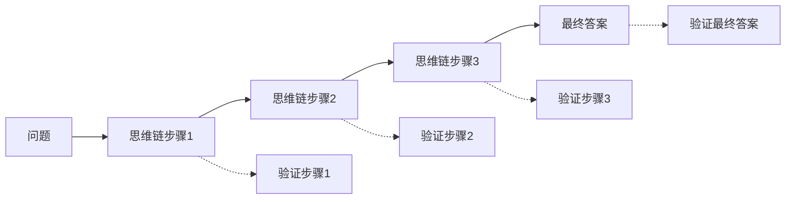

# Making Large Language Models Better Reasoners with Step-Aware Verifier

## 1. 概览 Overview

### 1.1 个人预览 Personal Preview

> LLM 在多步骤推理任务上仍然存在显著困难。文章提出了一种新的推理增强方法 Step-Aware Verifier（逐步验证），通过为同一问题生成多样化的思维链并引入单独的验证模型对推理链中的每个步骤进行正确性检测，从而大幅提升模型的推理准确性和可靠性。例如，在数学算术基准 GSM8K 上，该方法将现有最好的求解准确率从 74.4% 提升到了 83.2%。

### 1.2 内容简介 Description

- **研究背景 Research Background：**
LLM 在阅读理解、问答生成等任务上表现出色，但在需要多步推理的问题（例如数学推算、常识推理等）上仍经常出错。此前的研究表明，引导 LLM 先生成一系列中间推理步骤（即思维链）再给出最终答案，可以大幅提高推理正确率。然而，即使有了思维链，模型依然可能在推理过程中引入错误步骤，导致最终答案错误。
- **研究目标 Research Objectives：**
文章旨在进一步提升 LLM 在链式推理任务上的表现，通过在推理生成后增加一个 “逐步验证” 机制，检查思维链中每一步的正确性，从源头减少推理谬误。作者希望验证这种逐步验证策略能否比仅对最终答案投票（如 Self-Consistency 方法）获得更好的效果，同时探索多样化提示和投票机制对推理性能的影响。
- **主要贡献 Main Contributions：**
文章提出了一个名为 DIVERSE（Diverse Verifier on Reasoning Step）的新方法框架，其核心包括：
&emsp;&emsp;(1) 多样化提示：针对同一问题生成多种不同的思维链路径，增强推理的多样性探索。
&emsp;&emsp;(2) 投票验证器：训练一个验证模型对不同推理链的答案进行评估打分，并采用加权投票策略滤除错误答案。
&emsp;&emsp;(3) 逐步验证机制：进一步引入步骤级验证，对推理链中的每个中间步骤逐一判定正确性，从而找出推理过程中最早出现的错误步骤并降低其对最终答案的影响。
基于上述策略，DIVERSE 在 8 个常用推理基准上实现了新的性能提升，在其中 6 个基准上达到新的 SOTA 水平（例如 GSM8K 准确率由 74.4% 提升到 83.2%）。此外，人类评估结果表明，引入逐步验证后，模型生成的思维链中冗余步骤明显减少（含冗余步骤的正确推理路径比例由 31% 降至 20%），而对于最终错误的推理路径，其在出错前所累积的正确步骤数更多，体现了逐步验证对推理过程质量的改善。

---

## 2. 关键信息 Key Information

### 2.1 核心思想与方法 Main Ideas & Methods

- **核心思想：**
不同的示例可以引发 LLM 根本不同的推理策略。提示的多样性导致了更多样化的推理方法，即使某些路径有缺陷，也能增加至少一些路径正确的可能性。与其仅生成单一路径的思维链，DIVERSE 方法强调为每个问题生成多样的推理路径，并对这些推理链进行评估与筛选。通过引入一个独立的步骤验证模型，对推理链的每一步进行正确性判断，及时发现推理过程中的谬误。该策略将复杂推理任务拆解为 “生成+验证” 两个阶段：首先由 LLM 提供多种解题思路，然后由验证模型辨别并淘汰不可靠的推理，确保最终答案建立在可靠的推理基础上。

- **实现方法：**
DIVERSE 的实现依赖以下三个部分：

&emsp;&emsp;(1) 多样化提示生成思维链：当示例库中样本足够时，从示例库中随机采样 $M_1$ 个问题。当示例库中样本不足时，通过 “自我教学” 的方式使用少量示例样本与无推理路径问答对利用设计好的提示词产生 “伪推理路径” 来补齐示例。通过对每个问题设计不同风格或角度的提示，LLM 会产出多条不同的推理链，每条链包含若干中间步骤和最终答案。例如对同一道题可从不同假设出发各自推导答案，从而获得 $M_2$ 条候选推理路径。
&emsp;&emsp;(2) 投票验证筛选答案：将每条推理链连同原始问题一起输入预先训练的验证模型，让其评估该推理得出正确答案的置信度。验证模型综合考虑问题和完整推理过程，对每条推理链给出一个分数，代表该链正确无误的可能性。随后通过加权投票（根据评分高低）选出最可信的答案。这种方式比简单多数投票更注重推理质量而非数量。
&emsp;&emsp;(3) 步骤级验证：常规验证只对整条思维链给出整体评价，而 DIVERSE 进一步在链内引入逐步验证机制，即检查推理链中的每个关键步骤是否正确。具体而言，验证模型会标记推理中的每一步是否正确（例如数学运算是否正确，逻辑推断是否合理），一旦某一步骤被判为错误，就可以定位问题来源。在推理投票时，带有错误步骤的链条将受到惩罚或被剔除，从而避免错误步骤的累积传播影响最终答案。

### 2.2 实验设置与结果 Experimental Settings & Results

- **实验设置 Experimental Settings：**
作者在多个开放领域的推理任务上验证了 DIVERSE 方法的有效性，包括数学算术（如 GSM8K）、常识问答（CommonsenseQA）、符号推理（如 CLUTRR）等共 8 个基准数据集。模型采用 OpenAI 提供的 code-davinci-002 作为基础 LLM，并在无需额外训练模型参数的情况下，通过提示工程和验证器组合实现推理能力提升。
值得注意的是，验证模型本身是一个经过专门训练的判别模型，它利用一部分有标注的推理步骤数据进行训练，以学习判定推理过程正误的能力。在实验过程中，对于每个测试问题，DIVERSE 方法先随机采样 $M_1$ 种不同提示、每种提示下采样 $M_2$ 条思维链，从而得到 $M=M_1\times M_2$ 条候选解题路径；然后使用验证模型对每条路径进行打分并选出得分最高的答案作为最终解。

- **实验结果 Experimental Results：**
DIVERSE 在大部分基准上都取得了显著优于以往方法的成绩。以 GSM8K 为例，DIVERSE 将准确率提高到 83.2%，相比之前的最佳方法 Self-Consistency 的 74.4% 有明显提升。在 CommonsenseQA 等常识任务上也刷新了性能纪录。总体而言，DIVERSE 在 8 个基准中的 6 个实现了新的 SOTA。
有意思的是，在个别情形下逐步验证未带来收益：例如对 code-davinci-002 模型解决 GSM8K 时，引入步骤验证略微降低了准确率。作者推测原因可能在于该模型本身生成的推理质量已足够高，额外的步骤检查反而可能干扰了模型已有的判断。
此外，人工分析显示，DIVERSE 有效减少了正确推理路径中不必要的冗长步骤（相较普通验证器产生的思维链，冗余步骤比例从 31% 降至 20%），并且在错误的案例中，逐步验证版本往往能在出错前产出更多正确中间推理，使得整条链条更接近正确逻辑。
同时，作者观察到，95% 的错误是由错误的公式引起的（即使用错误的中间结果或运算符并生成无效公式，导致答案错误）。
这些结果表明，Step-Aware Verifier 不仅提升了最终答案的正确率，也在一定程度上优化了模型的推理过程质量。

---

## 3 分析思考 Analysis & Thoughts

### 3.1 文章结论 Conclusions

- **逐步验证提升推理可靠性：**
文章通过大量实验证明，引入逐步验证机制能够有效提高 LLM 的多步推理可靠性。通过对每一步推理进行审核，模型可以在错误传播为最终错误答案之前将其捕获并剔除。这种 “生成+验证” 范式将推理问题转化为生成候选与筛选候选的双阶段过程，大幅减少了因思维链中隐含错误导致答案错误的情况，验证了推理步骤质量对于最终性能的关键影响。
- **新范式下的通用性能突破：**
DIVERSE 方法在多个基准上达到新高性能，说明即使不提升底层模型规模，仅通过策略改进也能发掘 LLM 的潜在推理能力。尤其是对于算术和逻辑推理类任务，逐步验证结合投票策略显著优于仅依赖语言模型自身的推理输出，这为提高模型复杂推理能力提供了新的思路。值得一提的是，该方法的思想具有通用性，未来可推广到更多类型的推理任务或其他模型框架中。
- **局限与挑战：**
尽管 Step-Aware Verifier 展现出色效果，但其也带来额外的开销和挑战。一方面，验证模型的训练需要高质量的带标注推理过程数据，这在某些领域可能难以获取。同时，在推理时生成多条思维链并逐一验证会消耗更多计算资源，对于实时应用可能存在效率问题。另一方面，在基础模型已经非常强大的情形下，逐步验证未必总是收益，例如 code-davinci-002 在部分任务上就未从中获益。这提示我们，需要更好地了解在何种条件下验证策略是最有效的，以及如何自适应地决定是否启用步骤验证。

### 3.2 个人思考 Personal Thoughts

- **模型自我验证的可能性：** Step-Aware Verifier 引入了独立的验证模块来审核推理步骤，那么未来是否可以让 LLM 自身学会在推理时进行 “自我检查”？例如，在生成每一步后让模型回顾并判断这一步是否合理（类似自反思机制），再决定是否修改后续推理。这种内嵌的自检能力如果培养起来，或许可以减少对独立验证器和多条候选的需求，提升推理效率。
- **推理路径多样性的重要性：** DIVERSE 强调通过多样化提示得到不同推理路径，然后进行择优。这让我想到，在没有验证器的情况下，单一思维链往往不足以捕获复杂问题的所有要点。未来模型是否可以在一次推理中就自主地探索多种思路（类似树状思维 Tree-of-Thought），而不仅限于一种线性链条？如果模型能并行或分枝地展开推理，并内置机制比较不同分支的结果，将有望进一步提升复杂推理的可靠性。
- **评估指标与训练范式：** 本文凸显了对推理过程本身进行评估的重要性，而非仅关注最后答案对错。这启示我们，在训练和评测模型时，可以考虑将中间推理步骤的正确性纳入指标，甚至直接监督模型的思维链输出质量。通过奖励模型生成正确且高效的推理过程，可能比仅奖励最终答案正确更能培养模型的逻辑能力。这一点在强化学习反馈（RLAIF）等框架下值得进一步探索。

---

## 4. 关联文章 Related Works

- Zero-shot CoT
- Auto CoT
- CoT-SC
- Chain of Thought
